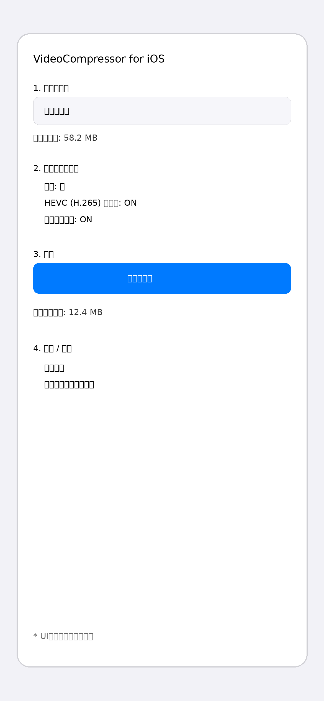

# VideoCompressor-For-iOS

動画圧縮くんのiOS版です（iOS 17以降対応）。

## 概要

Android版 [VideoCompressor](https://github.com/ryotn/VideoCompressor) と同じく、端末上の動画を選択して圧縮するアプリです。
圧縮処理は Apple 公式フレームワーク（`AVFoundation` / `PhotosUI` / `Photos`）のみを利用し、ffmpeg などの外部プラグインには依存しません。

## 実装済み機能

- PhotosPicker で動画を選択
- 圧縮前サイズ表示
- 画質（低/中/高）、HEVC優先、音声有無のオプション指定
- `AVAssetExportSession` を使った動画圧縮
- 圧縮進捗表示
- 圧縮後サイズ表示
- 圧縮結果の共有（ShareLink）
- 圧縮結果を写真ライブラリへ保存

## UIイメージ

## 開発要件

- 言語: Swift
- UI: SwiftUI
- 対応OS: iOS 17+
